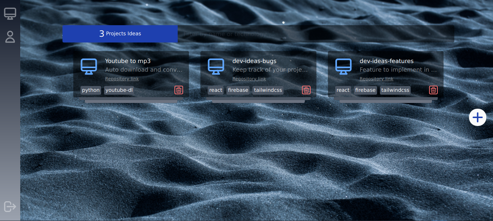

# Ideas-tab

Ideas-tab is a miniplatfrom to help you keep track of your side projects ideas,
save notes for yourself and much more ....



## Features

Ideas-tab allows you to:
* specify project name and repository
* specify technologies used on the projects
* save notes for yourself
* save related link to your project ideas

And more features to come.

## Build & Installation

Clone the project, build 

```
git clone https://github.com/ablil/ideas-tab
cd ideas-tab
yarn
yarn build
```
## Contribution

To contibute to this project feel free to create a pull request or contact me.

## Lisence
Ideas-tab is licensed under the Apache License, Version 2.0. See LICENSE for the full license text.